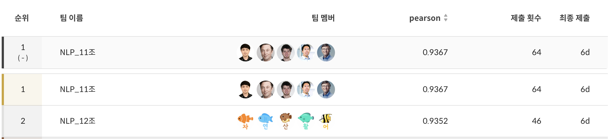
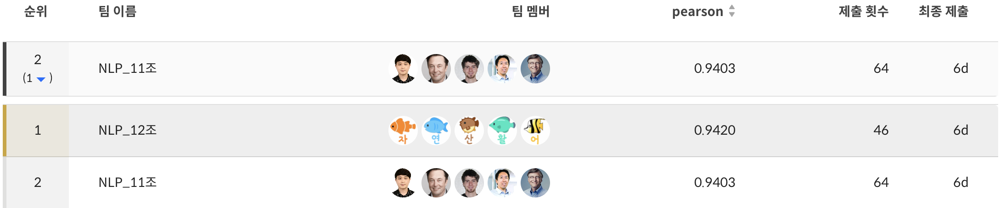

# 🏆 Level 1 Project :: STS(Semantic Text Similarity)

### 📜 Abstract
> 부스트 캠프 AI-Tech 5기 NLP Level 1 기초 프로젝트 경진대회로, Dacon과 Kaggle과 유사항 방식으로 진행되었습니다. 두 문장이 의미적으로 얼마나 유사한지를 수치화하는 N21 자연어처리 Task인 의미 유사도 판별(Semantic Text Similarity, STS)를 주제로 하여 진행하습니다. 모든 팀원이 데이터 전처리부터 모델의 하이퍼파라미터 튜닝에 이르기까지 AI 모델링의 전과정을 모두가 End-to-End로 협업하는 것을 목표로 프로젝트를 진행했습니다. 

## 🎖️Project Leader Board 
 
- 🥇 Public Leader Board

- 🥈Private Leader Board 


- [📈 NLP 11조 Project Wrap-Up report 살펴보기](https://github.com/boostcampaitech5/level1_semantictextsimilarity-nlp-11/blob/main/wrap-up_report/NLP%2011%EC%A1%B0%20Wrap-Up%20%EB%B3%B4%EA%B3%A0%EC%84%9C_%ED%8C%80%EC%B5%9C%EC%A2%85.pdf)


## 🧑🏻‍💻 Team Introduction & Members 

> Team name : 윤슬 [ NLP 11조 ] 

### 👨🏼‍💻 Members
강민재|김주원|김태민|신혁준|윤상원|
:-:|:-:|:-:|:-:|:-:
</img>|</img>|</img>|</img>|</img>
[Github](https://github.com/mjk0618)|[Github](https://github.com/Kim-Ju-won)|[Github](https://github.com/taemin6697)|[Github](https://github.com/jun048098)|[Github](https://github.com/SangwonYoon)
kminjae618@gmail.com|kjwt1124@hufs.ac.kr|taemin6697@gmail.com|jun048098@gmail.com|iandr0805@gmail.com

### 🧑🏻‍🔧 Members' Role
> 대부분의 팀원들이 첫 NLP 도메인의 프로젝트인만큼 명확한 기준을 가지고 업무를 구분한 것보다 다양한 인사이트를 기르기 위해 데이터 전처리부터 모델 튜닝까지 End-to-End로 경험하는 것을 목표로 하여 협업을 진행했습니다. 따라서 각자 튜닝할 모델을 할당하여 하이퍼 파라미터 튜닝을 하고 데이터 전처리, 증강 등 본인의 아이디어를 구현하되 서로의 내용이 겹치지 않도록 분업을 하여 프로젝트를 진행했습니다.

| 이름 | 역할 |
| --- | --- |
| 강민재 | **모델 튜닝**(electra-kor-base , koelectra-base-v3-discriminator),**데이터 증강**(back translation / switching sentence pair /임의글자삽입및제거),**데이터 전처리 실험**(레이블정수화및노이즈추가),**Ensemble **** 실험**(output 평균, 표준편차활용),**EDA**(글자수 기반 데이터 분포 분석) |
| **김태민** | **Hugging Face 기반 Baseline 코드 작성** , **Task에 적합한 모델 Search 및 분배** , **모델 실험 총괄** , **데이터 전처리 실험**(Random Token Masking , Label Random Noise, Fill Random Token Mask, Source Tagging), **Custom Loss 실험**(Binary Cross Entropy + Focal Loss),**모델 튜닝**(xlm-roberta-large, electra-kor-base),**모델 Ensemble** |
| **김주원** | **모델 튜닝**(kobigbird-bert-base, electra-kor-base),**EDA**(라벨 분포 데이터분석),**EDA 기반 데이터 증강 아이디어 제시** , **데이터 증강**(Easy Augmented DataSR 증강),**팀 협업 프로세스 관리**(Github 팀관리+ 팀Notion페이지관리) ,**Custom Loss 실험**(RMSE) |
| **윤상원** | **모델 튜닝**(koelectra-base-finetuned-nsmc, KR-ELECTRA-discriminator 모델튜닝),**데이터 증강**(label rescaling, 단순복제데이터증강, 어순도치데이터증강, under sampling + swap sentence + copied sentence + uniform distribution + random noise),**모델 Ensemble** |
| **신혁준** | **모델 튜닝**(KR-ELECTRA-discriminator, mdeberta-v3-base-kor-further )**데이터 증강**(맞춤법교정증강,EDA(Easy Data Augmentation) SR(Synonym Replacement)품사선택(명사, 조사) 교체+ swap sentence + copied sentence, Data Distribution),**데이터 전처리 실험**(맞춤법교정) |

## 🖥️ Project Introduction 


## 📁 Project Structure
```
📦level1_semantictextsimilarity-nlp-11
 ┣ .gitignore
 ┣ config_yaml
 ┃ ┣ kykim.yaml
 ┃ ┣ snunlpy.yaml
 ┃ ┣ test.yaml
 ┃ ┗ xlm_roberta_large.yaml
 ┣ data
 ┃ ┣ train.csv
 ┃ ┣ aug_train.csv
 ┃ ┣ dev.csv
 ┃ ┗ test.csv
 ┣ esnb
 ┃ ┗ esnb.csv
 ┣ output
 ┃ ┣ xlm_roberta_large.csv
 ┃ ┣ kykim.csv
 ┃ ┗ snunlp.csv
 ┣ .gitignore
 ┣ Readme.md
 ┣ augmentation.py
 ┣ dataloader.py
 ┣ esnb.py
 ┣ infer.py
 ┣ train.py
 ┗ utils.py
 ```

## 📐 Project Ground Rule


## 💻 Getting Started

### ⚠️ Requirements
```
```

### ⌨️How to Train 
```bash
#필요 라이브러리 설치
pip install -r requirements.txt
# train코드 실행 : 데이터 증강 + 모델 학습 진행
python3 train.py
```
### ⌨️ How to Inference
#예측 명령어 output.csv 생성
```bash
python3 infer.py 
```
